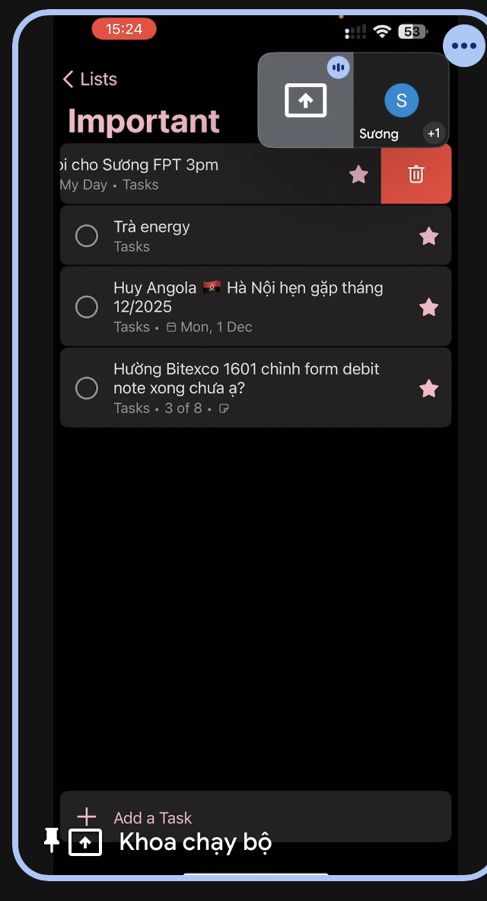
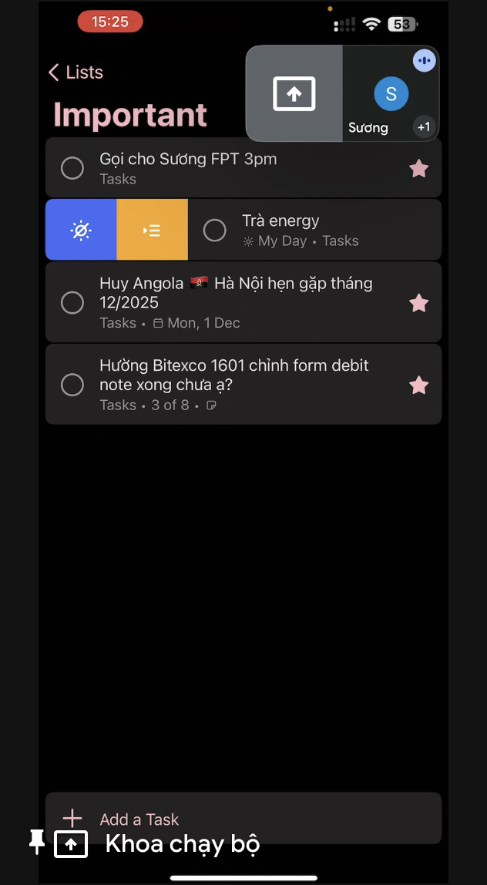
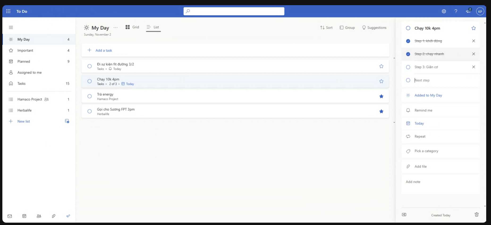
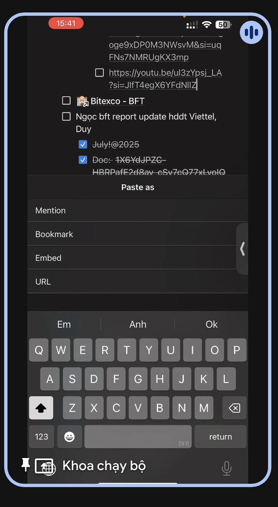
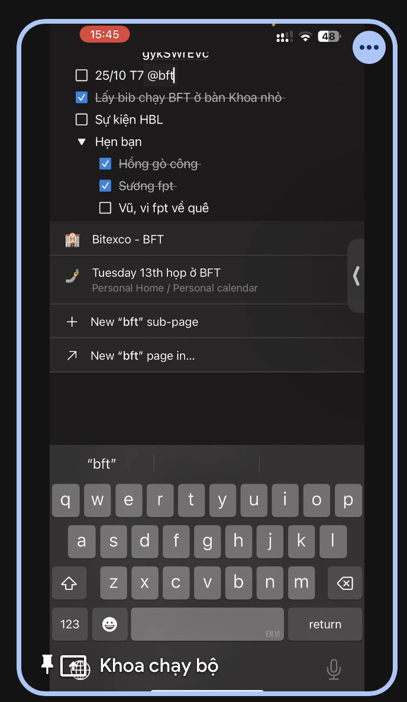

- yêu cầu:
- Tạo 1 item gồm tiêu
- 
 due date

thông báo

click 1 item xem chi tiết

icon sao là quan trọng hay không (quan trọng thì đẩy lên phía trên)
trên mobile


icon mat troi, my day thời gian
icon vàng 

trong 1 dự án sẽ có nhiều task
trong dự án sẽ có button share list todo task
 - type: tasks (chưa làm thêm dự án nào), dự án nào


- trong task sẽ có sub tasks con
- 

- sau khi tick check xong các sub task thì sẽ mack check ở task lớn và chuyển xuốn loại complete

dạng grid

share

authen


có note mô tả trong task, gắn link hay file

tính năng notion dạng tree view, sổ ra



mention

link tới dự án khác


mention dự án, contact

thông tin contact


dự án template herbalife
- Đăng ký thành viên
    - tao tk gmail
    - tao tk online
    - nop hs + cmnd
    - cho cty duyet
    - login học 7 phần dao duc kinh doanh
    - in cam ket 13
    - cty gửi thẻ về nhà
    - tao hbl VN Hub



- template mua sp
- template gioi thieu khac
- template bao tro khach moi
- template gioi thieu khach di su kien

theo dõi lẫn nhau
